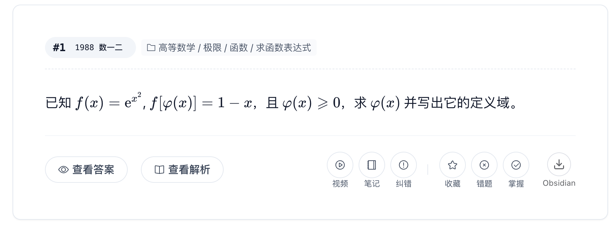
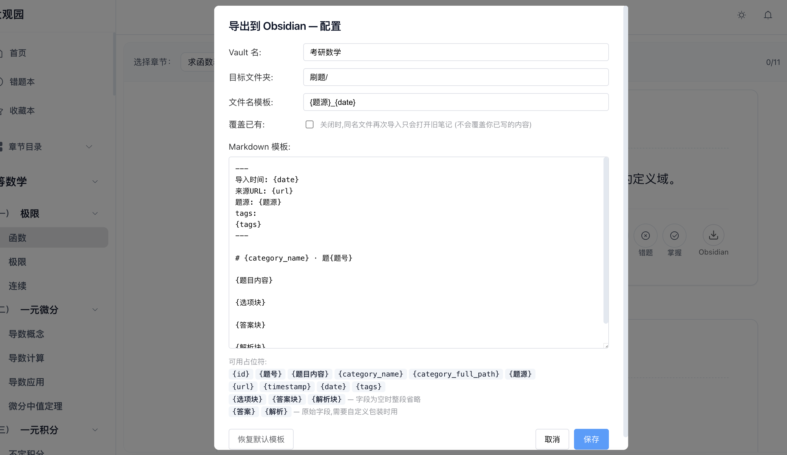
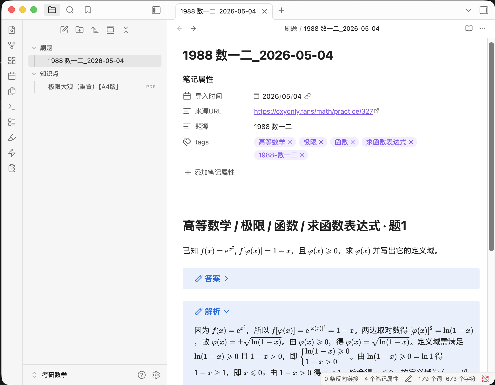

# cxyonlyfans → Obsidian

一个 Tampermonkey 油猴脚本,在 [cxyonly.fans](https://cxyonly.fans/) 题目卡片旁加一个按钮,点一下把这道题以 Markdown 笔记的形式发到 Obsidian。

走的是 `obsidian://new?...` URI 协议,不需要装 Obsidian 插件、不需要本地 server,但要求 Obsidian 已经打开 (或允许浏览器唤起)。

<p align="center">
  
</p>

## 为什么导出到 Obsidian

- **错题本免手抄** — 错过 / 想保留的题一键打包,LaTeX 公式照样渲染,网页端关站或题目下架都不影响以后翻看。
- **标签自动归类** — `category_full_path` 按 `/` 拆成独立 tag (`高等数学` / `极限` / `重要极限`),Obsidian 标签面板按层级浏览,几百道题也能定位。
- **双链串题与概念** — 在笔记里用 `[[泰勒展开]]` 链到自己整理的概念笔记,以后做错同类题,backlink 立刻告诉你"哪几题踩过同一个坑"。
- **二刷 / 熟练度自己加** — 模板里没硬编码主观字段,刷完自己在 frontmatter 加 tag (`#待复习` `#二刷` `#秒杀`),配合 Spaced Repetition 这类插件还能直接做闪卡复习。
- **本地、可搜、可同步** — 笔记是你 vault 里的纯 Markdown,断网能看、可以 grep、可以同步到任何地方,不被一个网站的可用性绑住。

## 安装

1. 浏览器装 [Tampermonkey](https://www.tampermonkey.net/)。
2. 打开 Tampermonkey 仪表盘 → "添加新脚本" → 把 [`cxy-to-obsidian.user.js`](cxy-to-obsidian.user.js) 全文粘贴覆盖默认骨架 → Ctrl/Cmd + S 保存。
3. 访问任意一道题目页 (例如 `https://cxyonly.fans/math/practice/329`),工具栏右侧应出现 **Obsidian** 圆形按钮。

## 首次配置

按钮点下去如果没填 Vault 会自动弹出配置面板,也可以在 Tampermonkey 扩展菜单里手动打开:

> Tampermonkey 图标 → `Obsidian 导出 - 配置`

<p align="center">
  
</p>

| 字段 | 说明 |
|---|---|
| **Vault 名** | Obsidian 侧边栏顶端那个 vault 名称,**必填**。区分大小写。 |
| **目标文件夹** | vault 内的相对路径,例如 `刷题/数学`。留空则放在 vault 根目录。 |
| **文件名模板** | 默认 `{id}`,支持占位符,见下表。 |
| **覆盖已有** | 关闭时,同名笔记再次导入只会打开旧文件 (不会覆盖你已写的内容);开启时会用新内容替换。 |
| **Markdown 模板** | 渲染笔记正文用的模板,支持占位符。 |

## 占位符

正文模板和文件名模板共享下表 (文件名里的非法字符会被替换成 `_`):

| 占位符 | 含义 |
|---|---|
| `{id}` | 题目数据库 ID |
| `{题号}` | 题目编号 (没有就 fallback 到 id) |
| `{题目内容}` | 题干 (LaTeX 已收紧为 Obsidian 兼容形式) |
| `{选项块}` | 选择题的 A/B/C/D 选项,无选项时为空 |
| `{答案块}` | 答案 (包成可折叠 callout `> [!note]- 答案`) |
| `{解析块}` | 解析 (同上) |
| `{答案}` `{解析}` | 原始字段,适合自己包装 |
| `{category_name}` | 题目所属分类的名字 |
| `{category_full_path}` | 分类完整路径,如 `高等数学/一元微分/导数概念` |
| `{题源}` | 题目来源,如 `900 第二章数二 A 类 4` |
| `{tags}` | 自动生成的 YAML tags 列表块,把 `category_full_path` 按 `/` 拆成多个独立标签,再加上 `题源` |
| `{url}` | 当前页面 URL |
| `{timestamp}` | 导入时刻,如 `2026-05-04 12:56:30` (文件名里冒号空格会自动转横线) |
| `{date}` | 仅日期部分 |

字段为空时,`{选项块} / {答案块} / {解析块}` 整段会省略;模板里连续 3 行以上空行会自动折叠成 2 行。

## 默认模板

```markdown
---
导入时间: {timestamp}
来源URL: {url}
题源: {题源}
tags:
{tags}
---

# {category_name} · 题{题号}

{题目内容}

{选项块}

{答案块}

{解析块}
```

<p align="center">
  
</p>

熟练程度等主观属性没有放进默认模板——刷完题在 Obsidian 里手动加 tag 即可。

## 工作原理

- 监听 `.action-toolbar` 的出现,匹配到题目卡片就把按钮注入工具栏右侧 (用 `MutationObserver`,SPA 翻页也能跟上)。
- 题目数据走站点公开 API `GET /api/questions/{id}`,带 cookie 拉,无需爬 DOM。
- 拼出 `obsidian://new?vault=...&file=...&content=...` URI,直接 `window.location.href` 跳转,Obsidian 拦截后建笔记。
- 内容编码用手写 `encodeURIComponent` 而不是 `URLSearchParams`,后者会把空格编成 `+` 而 Obsidian 解码时不还原,导致笔记里全是 `+`。
- LaTeX 公式过一道 `normalizeMath()`,把 `$ x $` 这种带空格风格收紧成 `$x$`,Obsidian 才会渲染。

## 已知限制

- URL 长度上限约 30000 字符 (脚本里有保护),超过会拒绝导出——超长题目极少见,但代码块多到爆的可能撞到。
- `obsidian://new` 不能附属性 (frontmatter 里写了什么就是什么),如果需要追加属性请改模板。
- `category_full_path` 按 `/` 拆成多个独立 tag,如果你想要 nested tag 风格 (`高等数学/一元微分` 当一个标签),需要改 [`buildTagsBlock`](cxy-to-obsidian.user.js#L94-L107)。
- 只在 `https://cxyonly.fans/*` 生效 (`@match`),换域名要改脚本头部。

## 修改 / 调试

脚本是单文件零依赖。改完直接在 Tampermonkey 编辑器 Ctrl/Cmd + S 重载,刷新题目页生效。失败信息会以右上角红色 toast 显示,详细堆栈在浏览器 Console (`[CXY→Obsidian]` 前缀)。

如果模板字段加新东西,记得同时在 [`renderTemplate`](cxy-to-obsidian.user.js#L133-L162) 的 `map` 里加映射,占位符列表也别忘了在配置面板说明里更新一下。
